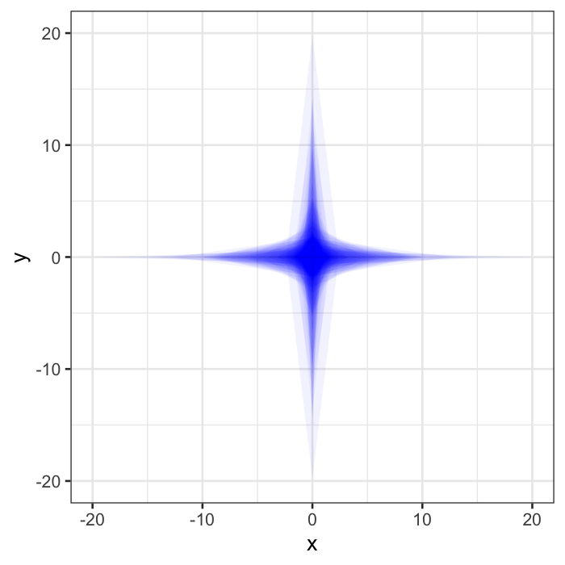
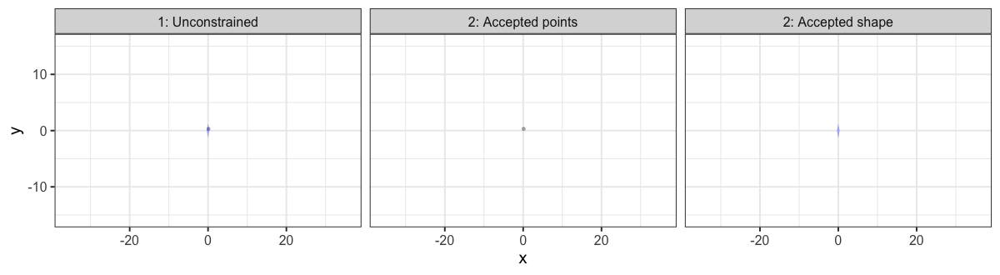
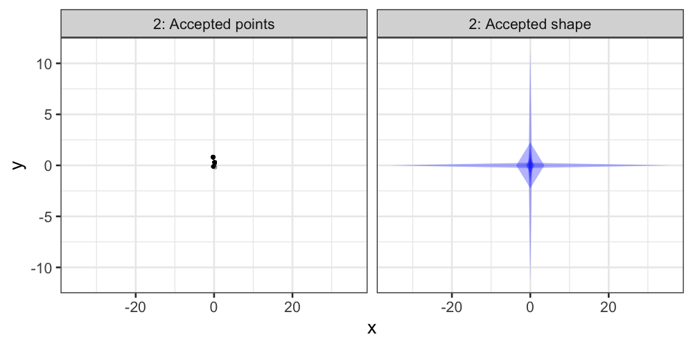
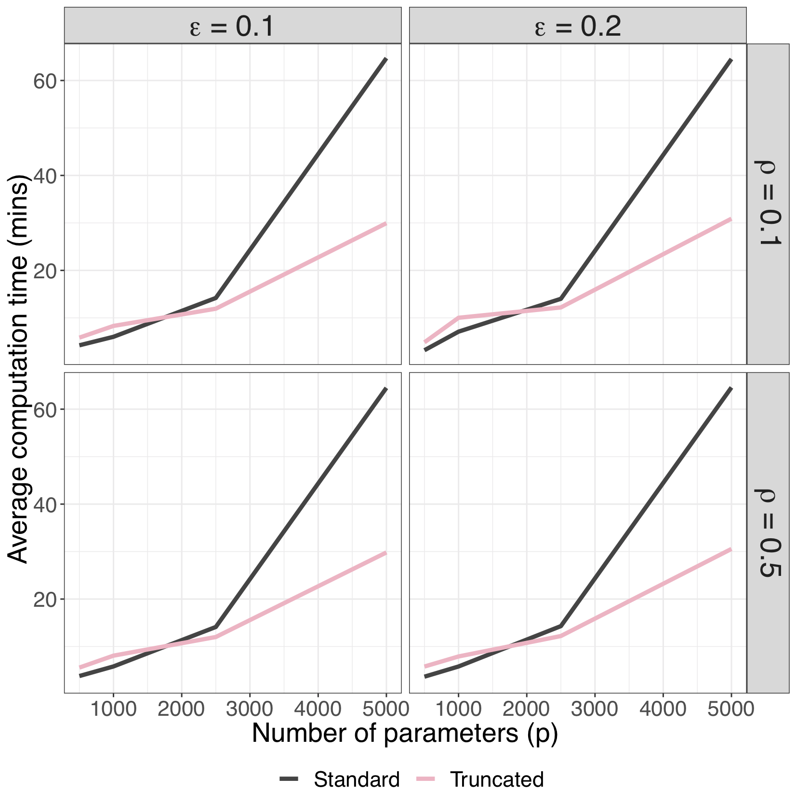
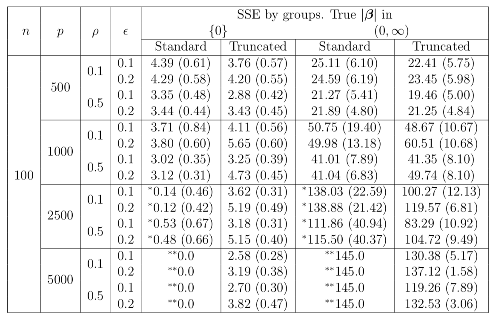
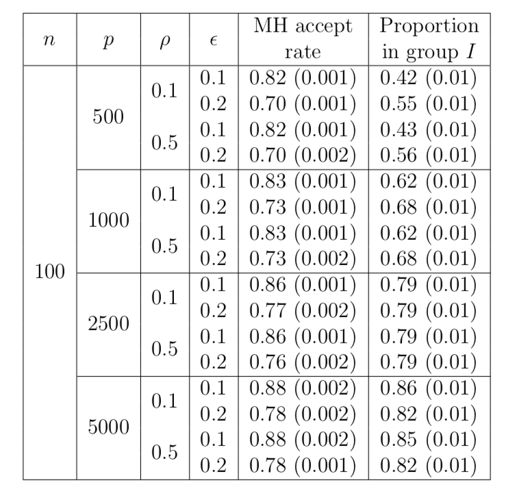
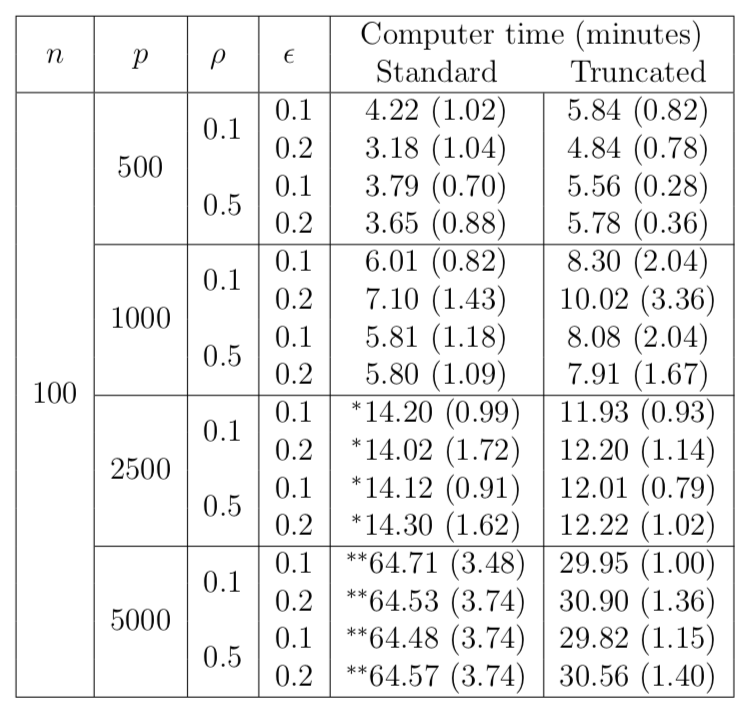

```{r setup, load_refs, include=FALSE, cache=FALSE}
library(RefManageR)
BibOptions(check.entries = FALSE,
           bib.style = "authoryear",
           cite.style = "authoryear",
           style = "html",
           hyperlink = FALSE,
           dashed = FALSE)
myBib <- ReadBib("bib-sc-sampler.bib", check = FALSE)

library(ggplot2)
source("one-dim-sc-example-viz.R")

```

## Talk outline
<br>
1. **Motivation from the (Bayesian) Lasso** 
<br><br><br>
2. **Stochastic constraints variables & Stochastic nets**
<br><br><br>
3. **New priors from stochastic constraints** 
<br><br><br>
4. **Faster samplers for High-dimensional shrinkage**
<br><br><br>
5. **Discussion**


---

## The Lasso 

```{r aqua-lasso-1, echo=FALSE, eval=TRUE, fig.align='center'}

```

<!--- If aquaman can use a lasso under water, what can I do? "Weird" ---> 

---

## The (Standard) Lasso

Optimization-based Lasso:
<br><br><br>

.pull-left[.full-width[.content-box-blue[
**Lagrangian**

$$\max_{\boldsymbol{\theta} \in \mathbb{R}^{p}} \log \pi(\boldsymbol{x}|\boldsymbol{\theta}) - \lambda \Vert \boldsymbol{\theta} \Vert_{1}$$
]]]

.pull-right[.full-width[.content-box-red[
**Constrained**

$$\max_{\tilde{\boldsymbol{\theta}} \in \mathbb{R}^{p}} \log \pi(\boldsymbol{x}|\tilde{\boldsymbol{\theta}}) ~\text{ s.t. }~ \Vert \tilde{\boldsymbol{\theta}} \Vert_{1} \leq \tilde{\omega}$$
]]]


--


- Lagrangian and constrained solutions are equal when $\tilde{\omega} = \Vert \boldsymbol{\theta}^{\star} \Vert_{1}$.

```{r tib-ref, echo=FALSE, eval=FALSE, results='asis'}
cat("<br><br><br> see ",Citet("Tibshirani1996", bib = myBib))
```

---

## The Bayesian Lasso

Probabilistic-based Lasso:
<br><br><br>

.pull-left[.full-width[.content-box-blue[
**Standard**

$$(\boldsymbol{x}|\boldsymbol{\theta}) \sim \pi(\boldsymbol{x}|\boldsymbol{\theta})$$
$$\boldsymbol{\theta} \overset{\text{iid}}{\sim} \text{DExp}(\lambda)$$
]]]

--

.pull-right[.full-width[.content-box-red[
**Constrained**

$$(\boldsymbol{x} \vert \boldsymbol{\theta}) \sim \pi(\boldsymbol{x} \vert \boldsymbol{\theta})$$

$$(\boldsymbol{\theta},\omega) \overset{\text{d}}{=} (\tilde{\boldsymbol{\theta}},\tilde{\omega}\;\; \text{s.t.}\;\; \Vert \tilde{\boldsymbol{\theta}} \Vert_{1} \leq \tilde{\omega})$$

$$\tilde{\boldsymbol{\theta}} \sim f_{\tilde{\boldsymbol{\theta}}} \propto 1 \qquad \tilde{\omega} \sim \text{Exp}(\lambda)$$
]]]

--

- Marginalising over $\tilde{\omega}$ results in the standard Bayesian Lasso.

--

- Both MAPs are equivalent to optimization-based Lasso (Lagrangian).

<!--- More complicated, but exposes inner facets, Marginalising over $\omega$ results in the original Bayesian Lasso. --->

---

## The regularization through constraints

Comparing the regularization:
<br><br><br>

.pull-left[.full-width[.content-box-red[
**Constrained optimization**

$$\Vert \tilde{\boldsymbol{\theta}} \Vert_{1} \leq \tilde{\omega}$$
]]]

.pull-right[.full-width[.content-box-red[
**Constrained prior**

$$(\boldsymbol{\theta},\omega) \overset{\text{d}}{=} (\tilde{\boldsymbol{\theta}},\tilde{\omega}\;\; \text{s.t.}\;\; \Vert \tilde{\boldsymbol{\theta}} \Vert_{1} \leq \tilde{\omega})$$

$$\tilde{\boldsymbol{\theta}} \sim f_{\tilde{\boldsymbol{\theta}}} \propto 1 \qquad \tilde{\omega} \sim \text{Exp}(\lambda)$$
]]]


--
<br><br>
The pdf for the prior is
$$p(\boldsymbol{\theta},\omega) \propto \exp(-\lambda\omega)1(\Vert \boldsymbol{\theta} \Vert_{1} \leq \omega)$$

<!--- 
	\item Closer connection between Bayesian and standard Lasso
	\item Connected by more than just the MAP
\end{itemize} --->


---

## Computation versus theory 

The pdf of the Lasso SC prior can also be written as a scale mixture of uniforms.
Using 1D as example:

.pull-left[.full-width[.content-box-red[
**Stochastic constraint**

$$p(\theta,\omega) \propto \exp(-\lambda\omega)1(\vert \theta \vert \leq \omega)$$
]]]

.pull-right[.full-width[.content-box-blue[
**Scale mixture of uniforms**

$$\begin{aligned}
(\theta~\vert~\omega) &\sim \text{U}(-\omega, \omega) \\
\omega &\sim \text{Gam}(2,1)
\end{aligned}$$
]]]


--

- This area of Bayesian computation is where priors with constraints have been used
   - Slice sampling `r Citep(myBib, "Neal2003")` 
   - SMU Lasso `r Citep(myBib, "Mallick2014new")`

--

- `r Citet(myBib, "Gelman2004")`: Re-parametrization for computation can also lead to theoretical insights (e.g. new priors)


---

## Duality and analogy to regularization
<br><br><br>

| *Inference*  | *Regularization*                                          |
|--------------|-----------------------------------------------------------|
| Optimization | Penalty $\Longleftrightarrow$ constraint                  |
| Bayesian     | Prior   $\Longleftrightarrow$ stochastic constraint prior |

--

<br><br>
<!--- The duality between stochastic constraint priors and their standard representation is analagous to the duality between penalty and constraint regularization in optimization.--->
There is a duality in the optimization setting, 

*and for the priors in a Bayesian analysis*.

---

## General stochastic constraint framework

For continuous random variables:

$$p(\boldsymbol{\theta},\boldsymbol{\omega}) \propto f_{\tilde{\boldsymbol{\theta}}}(\boldsymbol{\theta})~f_{\tilde{\boldsymbol{\omega}}}(\boldsymbol{\omega})~1(\boldsymbol{r}(\boldsymbol{\theta}) \preceq \boldsymbol{\omega})$$

--

|||
|---------------------------|--------------|
| Base prior               | $\tilde{\boldsymbol{\theta}} \sim f_{\tilde{\boldsymbol{\theta}}}, \quad \tilde{\boldsymbol{\theta}} \in \Theta \subseteq \mathbb{R}^{p}$  |
| Constraint variable      | $\tilde{\boldsymbol{\omega}} \sim f_{\tilde{\boldsymbol{\omega}}}, \quad \tilde{\boldsymbol{\omega}} \in \Omega \subseteq \mathbb{R}^{q}$ |
| Penalty function         | $\boldsymbol{r}(\boldsymbol{\theta}): \qquad \Theta \rightarrow \Omega$ |

--

**Key ideas**: 

- Truncation is applied *jointly* to base and constraint variables.

--

- Decomposition exposes marginal and multivariate components of the prior.

--

**Connections**: Scale mixture of normal/uniform, slice sampling, skew random variables, exponentially tilted random variables,...

<!---#### Base prior: 

$\tilde{\boldsymbol{\theta}} \sim f_{\tilde{\boldsymbol{\theta}}}, \quad \tilde{\boldsymbol{\theta}} \in \Theta \subseteq \mathbb{R}^{p}$.
    
#### Constraint variable: 

$\tilde{\boldsymbol{\omega}} \sim f_{\tilde{\boldsymbol{\omega}}}, \quad \tilde{\boldsymbol{\omega}} \in \Omega \subseteq \mathbb{R}^{q}$
    
#### Penalty function: 

$\boldsymbol{r}(\boldsymbol{\theta}): \Theta \rightarrow \Omega$ 


## Stochastic constraint framework

### Structure

$$(\boldsymbol{\theta}, \boldsymbol{\omega} \vert \boldsymbol{\lambda}) \overset{\text{d}}{=} (\tilde{\boldsymbol{\theta}}, \tilde{\boldsymbol{\omega}} \;\vert\;  \boldsymbol{r}(\tilde{\boldsymbol{\theta}}) \preceq \tilde{\boldsymbol{\omega}}, \boldsymbol{\lambda})$$

$$\tilde{\boldsymbol{\theta}} \sim f_{\tilde{\boldsymbol{\theta}}}$$ 
$$(\tilde{\boldsymbol{\omega}} \vert \boldsymbol{\lambda}) \sim f_{\tilde{\boldsymbol{\omega}}  \vert \boldsymbol{\lambda}}$$

The joint support of the joint distribution $(\tilde{\boldsymbol{\theta}}, \tilde{\boldsymbol{\omega}})$ is constrained element-wise by the inequality $\boldsymbol{r}(\tilde{\boldsymbol{\theta}} ) \preceq \tilde{\boldsymbol{\omega}}$.-->


---

## Examples

```{r aqua-lasso-2, echo=FALSE, eval=TRUE,  out.width = 732, out.height = 488}
knitr::include_graphics("imgs/aquaman-lasso2.gif")
```

---

## 1D example

| Base prior | Penalty | Constraint |
|------------|---------|------------|
| $\text{N}(0,1)$ | $-$ | $-$ |

```{r sc-example-1, echo=FALSE, eval=TRUE, out.width = 600, out.height = 400, fig.align='center'}
print(plot_normal)
```

---

## 1D example

| Base prior | Penalty | Constraint |
|------------|---------|------------|
| $\text{N}(0,1)$ | $\vert\theta\vert$ | $\text{Exp}(1)$ |

```{r sc-example-2, echo=FALSE, eval=TRUE, out.width = 600, out.height = 400, fig.align='center'}
print(plot_normal_l1_exp)
```

---

## 1D example

| Base prior | Penalty | Constraint |
|------------|---------|------------|
| $\text{N}(0,1)$ | $\vert\theta\vert$ | $\text{Gamma}(0.5,1)$ |

```{r sc-example-3, echo=FALSE, eval=TRUE, out.width = 600, out.height = 400, fig.align='center'}
print(plot_normal_l1_gamma)
```

---

## The Bayesian Lasso prior (again)

Stochastic constraint priors with an exponential constraint have two main forms: 
.pull-left[.full-width[.content-box-red[
**Global**

$$(\boldsymbol{\theta},\omega) \overset{\text{d}}{=} (\tilde{\boldsymbol{\theta}},\tilde{\omega}\;\; \text{s.t.}\;\; \Vert \tilde{\boldsymbol{\theta}} \Vert_{1} \leq \tilde{\omega})$$

$$\tilde{\boldsymbol{\theta}} \sim f_{\tilde{\boldsymbol{\theta}}} \propto 1 \qquad \tilde{\omega} \sim \text{Exp}(\lambda)$$
]]]

.pull-right[.full-width[.content-box-red[
**Local**

$$(\boldsymbol{\theta},\boldsymbol{\omega}) \overset{\text{d}}{=} (\tilde{\boldsymbol{\theta}},\tilde{\boldsymbol{\omega}}\;\; \text{s.t.}\;\; \vert \tilde{\theta}_{i} \vert \leq \tilde{\omega}_{i}, \; 1 \leq i \leq p)$$

$$\tilde{\boldsymbol{\theta}} \sim f_{\tilde{\boldsymbol{\theta}}} \propto 1 \qquad \tilde{\boldsymbol{\omega}} \overset{\text{iid}}{\sim} \text{Exp}(\lambda)$$
]]]

- $L_1$ versus box constraint have same marginal distribution due to memorylessness property of exponential.

- Motivates use of non-serperable penalty functions, or in BA hierarchies which break this property.

---

## The Bayesian Lasso posterior (again)

Bayesian Lasso prior and posterior with stochastic constraints:

.pull-left[.full-width[.content-box-red[
**Prior**

$$(\boldsymbol{\theta},\omega) \overset{\text{d}}{=} (\tilde{\boldsymbol{\theta}},\tilde{\omega}\;\; \text{s.t.}\;\; \Vert \tilde{\boldsymbol{\theta}} \Vert_{1} \leq \tilde{\omega})$$

$$\tilde{\boldsymbol{\theta}} \sim f_{\tilde{\boldsymbol{\theta}}} \propto 1 \qquad \tilde{\omega} \sim \text{Exp}(\lambda)$$
]]]

.pull-right[.full-width[.content-box-red[
**Posterior**

$$(\boldsymbol{\theta},\omega~\vert~\boldsymbol{y}) \overset{\text{d}}{=} (\tilde{\boldsymbol{\theta}},\tilde{\omega}\;\; \text{s.t.}\;\; \Vert \tilde{\boldsymbol{\theta}} \Vert_{1} \leq \tilde{\omega}~\vert~\boldsymbol{y})$$

$$(\tilde{\boldsymbol{\theta}}~\vert~\boldsymbol{y}) \sim f_{\tilde{\boldsymbol{\theta}}~\vert~\boldsymbol{y}}  \qquad \tilde{\omega} \sim \text{Exp}(\lambda)$$
]]]

- Posterior is also a stochastic constraint random variable

- Learning how to sample SC can transfer to posterior samplers

---

## Stochastic nets

- A restricted family of stochastic constraint priors

.pull-left[.full-width[.content-box-blue[
$$\begin{aligned}
	\left(\boldsymbol{\theta}, \omega \vert \boldsymbol{k} \right) &\overset{\text{d}}{=} \left( \tilde{\boldsymbol{\theta}}, \tilde{\omega} \mid  \Vert \tilde{\boldsymbol{\theta}} \oslash \boldsymbol{k} \Vert_{\nu}^{\nu} \leq \tilde{\omega},  \boldsymbol{k}\right) \\ 
	\tilde{\boldsymbol{\theta}} &\sim f_{\tilde{\boldsymbol{\theta}}} \propto 1, \quad \tilde{\boldsymbol{\theta}} \in \mathbb{R}^{p} \\ 
	 \tilde{\omega} &\sim \text{Exp}(1) \\
	 \boldsymbol{k} &\sim f_{\boldsymbol{k}}
\end{aligned}$$
]]]

.pull-right[
```{r sc-reject-shape, echo=FALSE, eval=TRUE, fig.align='center', out.height=300, out.width=360}

```
]

- Includes continuous shrinkage priors (horseshoe etc.)

---

## Visualisation of generative process

$$(x,y) \sim \text{N}(0,1)$$

$$\boldsymbol{\lambda} \sim \text{Dir}(1,1)$$

$$\tau \sim \text{Exp}(2)$$

$$\text{s.t. } \lambda_{1}\vert x \vert + \lambda_{2}\vert y \vert \leq \tau$$

```{r sc-reject-gif, echo=FALSE, eval=TRUE, fig.align='center'}

```

---

## Visualisation of generative process

$$(x,y) \sim \text{N}(0,1)$$
$$\boldsymbol{\lambda} \sim \text{Dir}(1,1)$$

$$\tau \sim \text{Exp}(2)$$

$$\text{s.t. } \lambda_{1}\vert x \vert + \lambda_{2}\vert y \vert \leq \tau$$

```{r sc-reject-pause, echo=FALSE, eval=TRUE, fig.align='center'}

```

---

## Horseshoe prior as stochastic net

.content-box-blue[
$$(\boldsymbol{\theta}, \omega \;\vert\; \boldsymbol{\lambda}) \overset{\text{d}}{=} \left( \tilde{\boldsymbol{\theta}}, \tilde{\omega} \;\vert\; \Vert\tilde{\boldsymbol{\theta}} \oslash \boldsymbol{\lambda} \Vert_{2}^{2} \leq \tilde{\omega}, \boldsymbol{\lambda} \right)$$
$$\tilde{\boldsymbol{\theta}} \sim f_{\tilde{\boldsymbol{\theta}}} \propto 1$$
$$\tilde{\omega} \sim \text{Exp}(1/2)$$
]


$$\lambda_{i} \sim \text{Cauchy}_{+}(0,1) \quad \text{for } 1 \leq i \leq p$$
$$\tau  \sim \text{Cauchy}_{+}(0,1)$$
--

Similar representations exist for
- Scale-normal mixtures
- Regularized-horseshoe
- Dirichlet-Laplace
- R2-D2 prior
- And "local" versions of these

<!--- Add box around SC part to demo marginalisation?--->

---
layout: false
class: inverse, middle, center

## Examples of new priors with stochastic constraints

---

## Horseshoe with informative means

Simple horseshoe prior ($\tau = \sigma = 1$)

$$(\boldsymbol{\theta}, \omega \;\vert\; \boldsymbol{\lambda}) \overset{\text{d}}{=} \left( \tilde{\boldsymbol{\theta}}, \tilde{\omega} \;\vert\; \Vert\tilde{\boldsymbol{\theta}} \oslash \boldsymbol{\lambda} \Vert_{2}^{2} \leq \tilde{\omega}, \boldsymbol{\lambda} \right)$$
$$\tilde{\boldsymbol{\theta}} \sim f_{\tilde{\boldsymbol{\theta}}} \propto 1$$
$$\tilde{\omega} \sim \text{Exp}(1/2)$$
$$\lambda_{i} \sim \text{Cauchy}_{+}(0,1)$$

Under a normal means model, the horseshoe prior is known to have shrinkage profile

$$
\text{E}(\theta_{i},k_{i}|\boldsymbol{y}) = (1-k_{i})y_{i}  
$$
with $k_{i} \sim \text{Beta}(1/2,1/2)$

---

## Horseshoe with informative means

Simple horseshoe prior ($\tau = \sigma = 1$) with informative base prior

$$(\boldsymbol{\theta}, \omega \;\vert\; \boldsymbol{\lambda}) \overset{\text{d}}{=} \left( \tilde{\boldsymbol{\theta}}, \tilde{\omega} \;\vert\; \Vert\tilde{\boldsymbol{\theta}} \oslash \boldsymbol{\lambda} \Vert_{2}^{2} \leq \tilde{\omega}, \boldsymbol{\lambda} \right)$$

$$\tilde{\theta}_{i} \sim \text{N}(\mu_{i},\phi_{i}) \quad \text{for } 1 \leq i \leq p$$

$$\tilde{\omega} \sim \text{Exp}(1/2)$$
$$\lambda_{i} \sim \text{Cauchy}_{+}(0,1)$$

Under a normal means model, the **informative** horseshoe prior has shrinkage profile

$$
\text{E}(\theta_{i},k_{i}|\boldsymbol{y}) = \frac{(1-k_{i})(y_{i} + \mu_{i}\phi_{i}^{-1} )}{1 + (1-k_{i})\phi_{i}^{-1}}
$$
with $k_{i} \sim \text{Beta}(1/2,1/2)$

---

## Positively-skewed Horseshoe

---
layout: false
class: inverse, middle, center

## Faster sampling for high-dimensional continuous shrinkage priors

---

## Gibbs samplers for continuous-shrinkage priors

**Normal model**: $(\boldsymbol{y} ~\vert~ \boldsymbol{X}, \boldsymbol{\beta},\sigma^2) \sim \text{N}(\boldsymbol{X} \boldsymbol{\beta}, \sigma^2\boldsymbol{I})$.

--

### Ingredients of standard algorithm

--

(a) Sample $(\boldsymbol{\beta}~\vert~ \boldsymbol{\lambda}, \sigma^2, \tau) \sim \text{N}(\boldsymbol{\mu},\boldsymbol{V})$.
   - $\boldsymbol{\mu} = \boldsymbol{V}\boldsymbol{X}^{\top}\boldsymbol{y}$
   - $\boldsymbol{V} = (\boldsymbol{X}^{\top}\boldsymbol{X} + \boldsymbol{S}^{-1})^{-1}$
   - $\boldsymbol{S}$ = diagonal matrix from $\boldsymbol{\lambda}$ and $\tau$.

--

(b) Sample $(\sigma^2~\vert~\boldsymbol{\beta}, \boldsymbol{\lambda}, \tau) \sim \text{IG}(a_{1},a_{2})$

--

(c) Sample $(\boldsymbol{\lambda}~\vert~\boldsymbol{\beta}, \sigma^2, \tau)$

--

(d) Sample $(\tau~\vert~ \boldsymbol{\beta}, \boldsymbol{\lambda}, \sigma^2)$

--

**Q:** What is the computational bottleneck of this algorithm?

--

**A:** Inverting (or decomposing) $\boldsymbol{V}$ is $\mathcal{O}(p^3)$.

---

### Truncated-Gibbs sampler

**Aim**: Exploit the geometry by decomposing the prior to create a better Gibbs sampler.

--

(a1) Sample $(\boldsymbol{\omega}~\vert~\boldsymbol{\beta}, \boldsymbol{\lambda}, \sigma^2, \tau) \sim \text{sExp}(b_1)$

--

   - Use $\boldsymbol{\omega}$ (current magnitude) to choose appropriate sampling step, namely

--
   
   - Order $\boldsymbol{\omega}$ by size and split into two groups, $I$ and $J$. Where $\omega_{i} \leq \epsilon$ for $i \in I$.


--

(a2) Sample $(\beta_{i}~\vert~ \boldsymbol{\beta}_{(i)},\boldsymbol{\omega}, \boldsymbol{\lambda}, \sigma^2, \tau) \sim \text{U}(-\omega_{i}^{1/\nu},\omega_{i}^{1/\nu})$ with MH correction for $i \in I$.

--

   - The dependence on $\boldsymbol{\beta}_{(i)}$ exists but is very small. You can argue that $(\beta_{i}~\vert~ \boldsymbol{\beta}_{(i)},\boldsymbol{\omega}, \boldsymbol{\lambda}, \sigma^2, \tau) \overset{d}{\approx} (\beta_{i}~\vert~\boldsymbol{\omega}, \boldsymbol{\lambda}, \sigma^2, \tau)$ if $\epsilon$ is small enough.

--

(a3) Sample $(\boldsymbol{\beta}_{J}~\vert~ \boldsymbol{\beta}_{I}, \boldsymbol{\lambda}, \sigma^2, \tau) \sim \text{N}(\boldsymbol{\mu}_{J|I},\boldsymbol{V}_{J|I})$.

--

   - Note: $\boldsymbol{\omega}$ marginalised out. Not necessary, but practical.


---

### Truncated-Gibbs sampler

**Aim**: Exploit the geometry by decomposing the prior to create a better Gibbs sampler.

(a1) Sample $(\boldsymbol{\omega}~\vert~\boldsymbol{\beta}, \boldsymbol{\lambda}, \sigma^2, \tau) \sim \text{sExp}(b_1)$

(a2) Sample $(\beta_{i}~\vert~ \boldsymbol{\beta}_{(i)},\boldsymbol{\omega}, \boldsymbol{\lambda}, \sigma^2, \tau) \sim \text{U}(-\omega_{i}^{1/\nu},\omega_{i}^{1/\nu})$ with MH correction for $i \in I$.

(a3) Sample $(\boldsymbol{\beta}_{J}~\vert~ \boldsymbol{\beta}_{I}, \boldsymbol{\lambda}, \sigma^2, \tau) \sim \text{N}(\boldsymbol{\mu}_{J|I},\boldsymbol{V}_{J|I})$.

--

**Complexity**: 

- $\mathcal{O}(\vert J \vert^{3} + p \vert I\vert)$ in each iteration.

--

- We can fix $\vert J \vert$ by selecting $\epsilon$. Then the complexity is $\mathcal{O}(p^2)$.

---

### Truncated-Gibbs sampler summary

- In high dimensions with shrinkage priors, the majority of coefficients are forced to be very close to zero.
 
--
 
- Understanding the structure and geometry of the problem is important!


--

Be like Aquaman!
<br><br>
```{r more-aqua, echo=FALSE, eval=TRUE, fig.align='center'}

```

---

## Results on some toy problems

Model: Linear regression, iid Gaussian errors, using R2-D2 prior

Simulation settings:

$n = 100$

$p \in \{500,1000,2500,5000\}$

$\rho \in \{0.1,0.5\}$, controls correlation in $\boldsymbol{X}$

$\epsilon \in \{0.1,0.2\}$

$\boldsymbol{\beta} = [\boldsymbol{0}_{10}^{\top}~\boldsymbol{b}_{1}^{\top}~\boldsymbol{0}_{30}^{\top}~~\boldsymbol{b}_{2}^{\top}~\boldsymbol{0}_{p-50}^{\top}]^{\top}$

$\boldsymbol{b}_{1} = [2,~2,−5,−5,−5]$

$\boldsymbol{b}_{2} = [−2,−2,−2,~5,~5]$

$2000$ samples repeated independently 100 times.

---

### Mean (SD) computation time

```{r comp-viz, echo=FALSE, eval=TRUE, fig.align='center', out.height=500, out.width=500}

```

---

### Posterior mean (SD) of coefficient SSE

```{r sse-table, echo=FALSE, eval=TRUE, fig.align='center', out.height=500}

```

---

### Grouping and uniform proposal

```{r accept-table, echo=FALSE, eval=TRUE, fig.align='center', out.height=500,out.width=550}

```

<!---### Mean (SD) computation time

```{r time-table, echo=FALSE, eval=TRUE, fig.align='center', out.height=550,out.width=450}

``` 
--->

---
layout: false
class: inverse, middle, center

## Discussion

---

## Strengths of SCP

- More views of shrinkage, e.g. rare event estimation

---

## Weaknesses of SCP

- Remedies

---

## Conclusions

- One technique for scaling with dimension where sparsity is desired.

- Can be combined with other techniques

- Other areas under investigation with stochastic constraints:

   - Theoretical results
   
   - Discrete version

   - Prior construction
   
   - Variable selection from continuous-shrinkage prior
   
   - You tell me!
   
- Acknowledgements: 

   - Berwin Turlach, Kevin Murray, Chris Drovandi
   - Pawsey HPC
   - QUT & ACEMS

---

```{r aqua-flying-fish, echo=FALSE, eval=TRUE, fig.align='center'}
knitr::include_graphics("imgs/aquaman-flying-fish.gif")
```


---

## References

```{r bib-list, echo = FALSE, results='asis'}

RefManageR::PrintBibliography(myBib)

```
